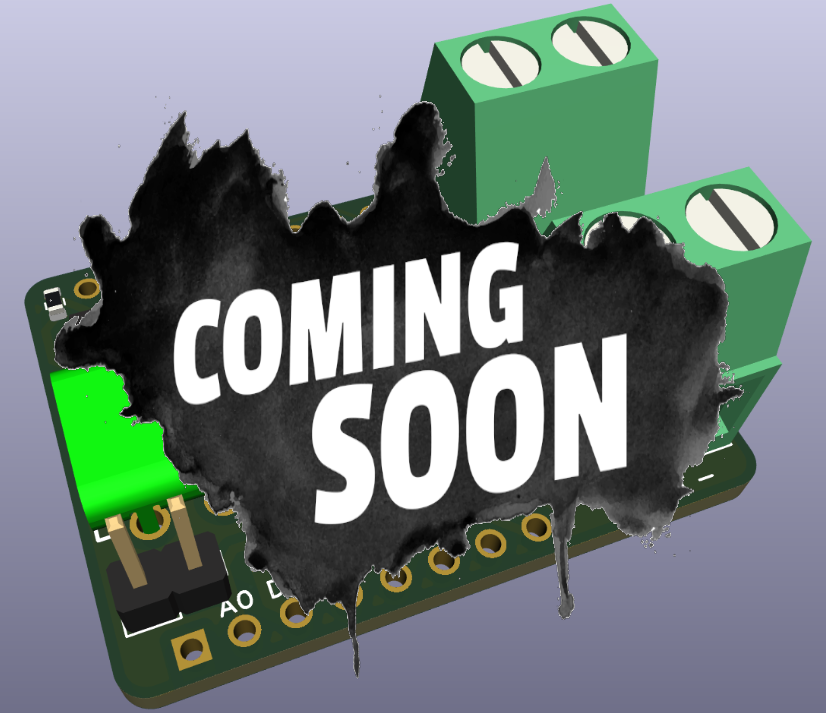

# The WLED-DC-Sensor-Board

## WLED Neopixel projects 

The `electrical current shunt board` combined with an ESP8266 D1-mini microcontroller and the Arduino library [SensorWLED](https://github.com/berrak/SensorWLED) make it easy to measure up to 10 Ampere with reasonable accuracy. 

Tracking fast-changing Neopixel pixel currents with the WLED DC sensor is a perfect application example. That was the specific design objective. 
Unfortunately, the varying current level is often only roughly estimated in [WLED projects](https://kno.wled.ge).
 
The female header breaks out I2C-signals, VCC (3.3V), and GND for a small OLED display. Alternatively, use a larger SPI-based display or send data with WiFi for remote monitoring.

## Board main features

The Texas Instrument INAx180 low- and high-side voltage output current-sense amplifier has the following main characteristics.

- Common-mode range (V CM ): –0.2 V to +26 V
- Output slew rate: 2 V/μs
- Offset voltage:
±150 μV (maximum) at V CM = 0 V
±500 μV (maximum) at V CM = 12 V
- Accuracy:
 ±1% gain error (maximum)
 1-μV/°C offset drift (maximum) 
 - Gain: 200V/V
 - Quiescent current: 260 μA maximum

The current sense resistor (1.5 mOhm, 1%, 50ppm/C) handles currents up to 10A.

## Items to add

- Wemos/Lolin D1-mini ESP8266 microcontroller. The WLED sensor becomes a shield on top of the controller.
- Female header pins for the microcontroller.
- Display (I2C interface) for current readings.

Measured values are not strictly required to display on an OLED since they are accessible through a web browser. Neither is the usage of an ESP8266. Instead, use the sensor with, for example, ESP32 and wire the I2C signals from the sensor to the microcontroller. Pull-up resistors, e.g., <=3.3 kOhm to VCC on the I2C signals, are recommended.

## Usage

Please, see the documentation for the Arduino library [SensorWLED](https://github.com/berrak/SensorWLED/).

## Specification for the WLED sensor board v1.0

The fabricated two-layer board has the dimensions of 26.0 x 34.2 mm (1.02"x1.35").

| parameter | imperial | metric |
| -----------|-------|------|
| board material | FR4 | FR4 |
| board thickness | 39 mil | 1.0 mm |
| copper layer thickness | 1.4 mil | 35 um |
| board color | purple | purple |
| board text | white | white |
| board weight | 2.82 oz | 80 gram |

## The board is fully assembled and tested

The WLED current sensor board will be available fully assembled when released.

## Purchase the board
Find all my latest designed boards on `Tindie`. 

I appreciate your support.

## Credits

`Coming soon` splash image by [starline](https://www.freepik.com/free-vector/abstract-grunge-style-coming-soon-with-black-splatter_9504688.htm#query=coming%20soon&position=4&from_view=keyword).
