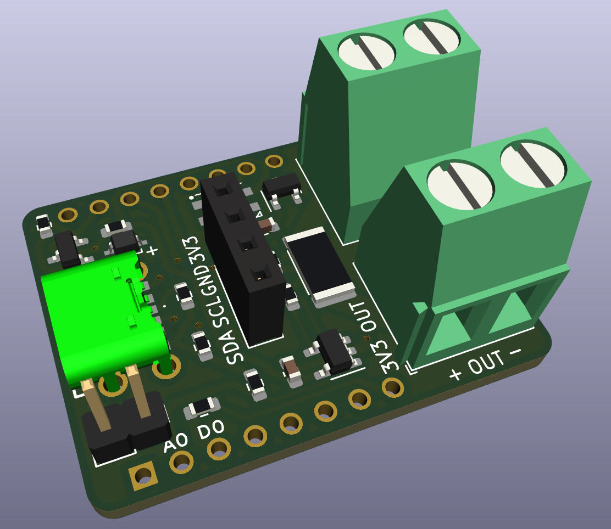

# The WLED-DC-Sensor-Board

## WLED Neopixel projects 

Fast-changing Neopixel pixel currents of the WLED DC sensor are a perfect application example. That was the specific design objective. Unfortunately, the varying current level is often only roughly estimated in such [WLED projects](https://kno.wled.ge).

Together with an ESP8266 D1-mini microcontroller and the Arduino library [SensorWLED](https://github.com/berrak/SensorWLED) split the input `DC varying analog signal` into components. The library methods return these as read, while other functions hold the peak value while decaying with user-set decay parameters.
 
- Keep peak value readings on display for humans to record while at the same time following real-time updates in parallel without loss of information.
- The library support exponential- and linear decay rate for slow and fast superimposed DC signals, respectively.
- Create fast-changing VU-meters or equally track DC disturbances occurring widely apart in time.

The library can be used on any analog microcontroller input, thus not requiring the sensor board.

## Items to add

- Wemos/Lolin D1-mini ESP8266 microcontroller. The WLED sensor becomes a shield on top of the controller.
- Female header pins for the microcontroller.
- Display (I2C interface) for current readings.

Measured values are not strictly required since they are accessible through a web browser. Neither is the usage of an ESP8266. Instead, use the sensor with, for example, ESP32 and wire the I2C signals from the sensor to the microcontroller.

## Usage

Please, see the documentation for [SensorWLED](https://github.com/berrak/SensorWLED/).

## Specification for the WLED sensor board v1.0

The fabricated two-layer board has the dimensions of 26.0 x 34.2 mm (1.02"x1.35").

| parameter | imperial | metric |
| -----------|-------|------|
| board material | FR4 | FR4 |
| board thickness | 39 mil | 1.0 mm |
| surface finish | HASL | HASL |
| copper layer thickness | 1.4 mil | 35 um |
| board color | black | black |
| board text | white | white |
| board weight | 2.82 oz | 80 gram |

*HASL or HAL*: Hot air (solder) leveling is a finish used on printed circuit boards.

## The board is fully assembled and tested

The WLED current sensor board is available only fully assembled.

## Purchase the board
Find all the latest designed boards on `Tindie`. 

I appreciate your support.